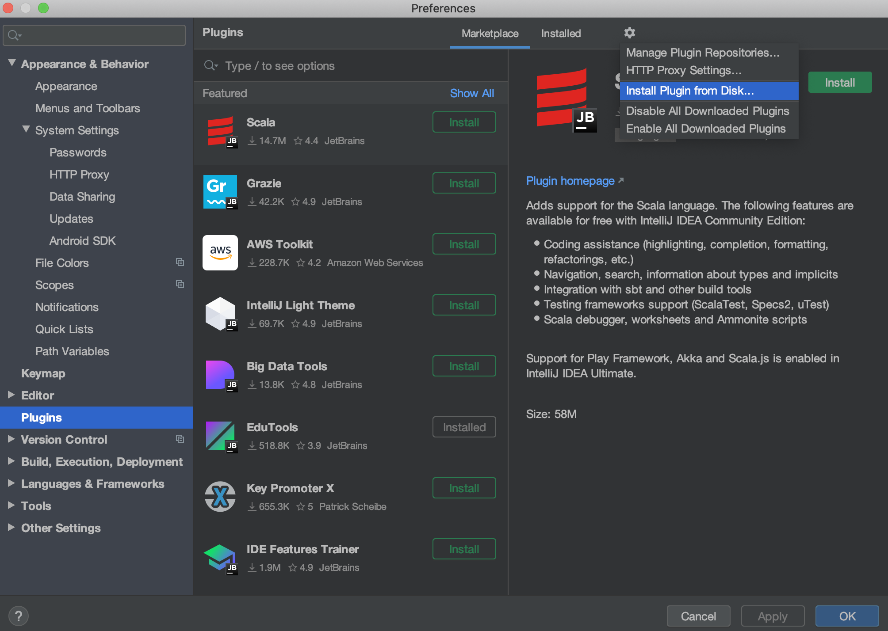

# Bigdata Accelerator

this is a jetbrains plugin in for datagrip/database tool,
it have 2 features now:

### 1

replace sql param like this(start with three -):

```SQL
--- $a=1
SELECT $a
```
(mainly for copy from/to grafana without change)

### 2

sync sql snippet to other files under parent parent folder

* before sync
```SQL
-- A.sql
-- toSyncSnippet {
SELECT 1
--}
```

```SQL
-- B.sql
-- toSyncSnippet {
--}
```

* after run sql sync on file A.sql
```SQL
-- A.sql
--- toSyncSnippet {
SELECT 1
--}
```

```SQL
-- B.sql
--- toSyncSnippet {
SELECT 1
--}
```

## How to use
* Right Click on sql file, find the right item

## How to Install
* From Preference/plugin
